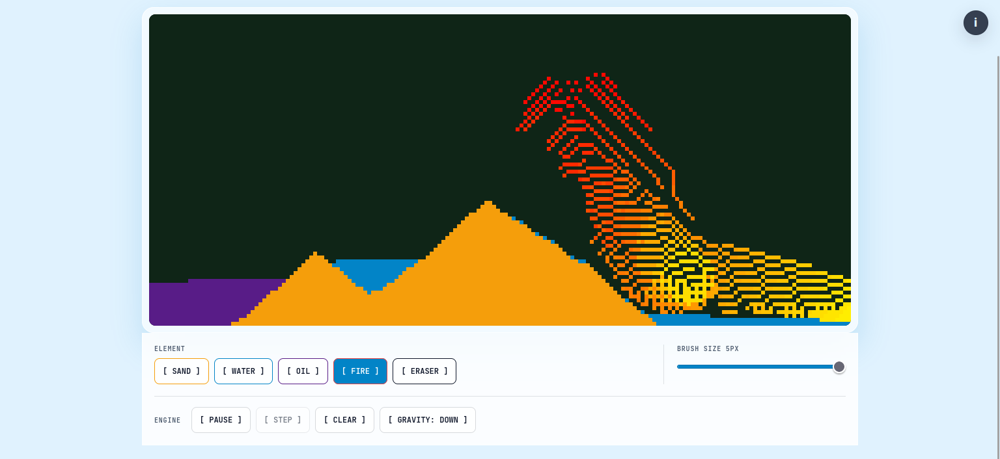
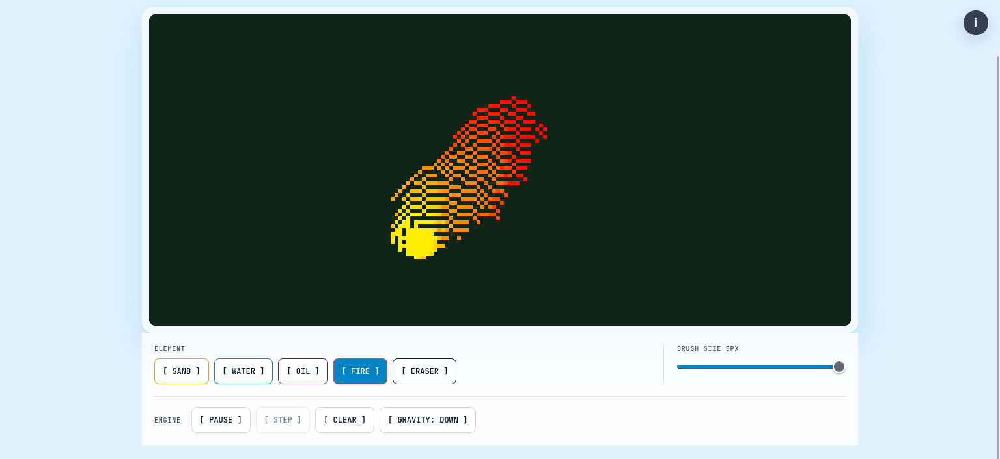

# Hyper Sand Sandbox

Hyper Sand Sandbox is a browser-based cellular automaton sandbox for sand, water, oil, and fire for now.

## Run Locally

```bash
npm install
npm run dev
```

## Architecture

```text
Canvas UI
   ↓
EngineCore
   ↓
Cellular-automata physics
   ↓
CanvasRenderer
```

(Will post detailed flow soon)

This was made initially in 3 days during a vibe coding session to explore ChatGPT Codex. More serious development will be done later.

<p align="center">
  
  
</p>
